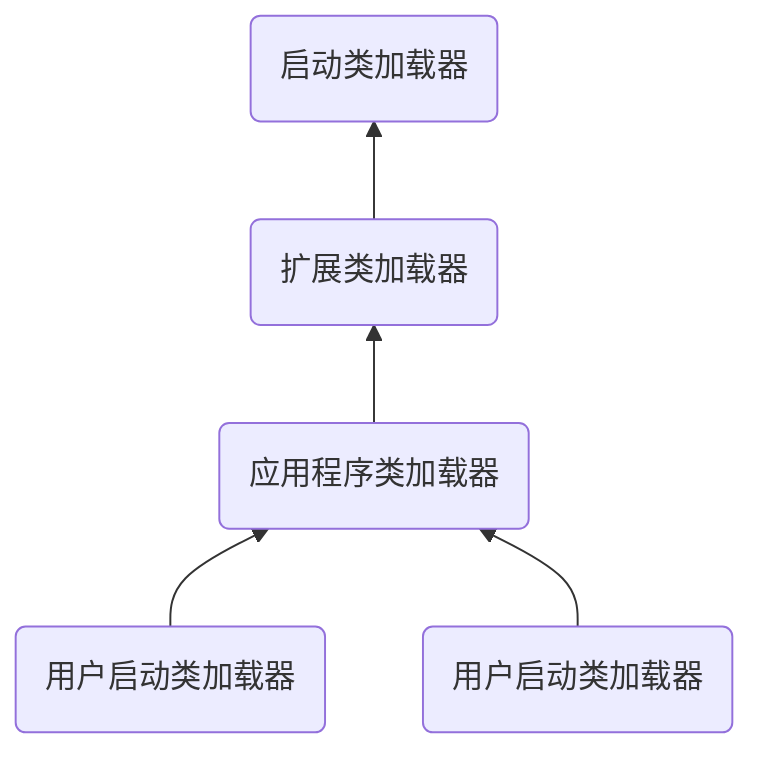

## 类加载

### 1. 概述

**虚拟机的类加载机制：**

> ​	Java虚拟机把描述类的数据从Class文件加载到内存，并对数据进行校验、转换解析和初始化，最终形成可以被虚拟机直接使用的Java类型。

### 2. 类加载的时机


六种情况下必须对类进行初始化：

1. 遇到`new`、`getstatic`、`putstatic`和`invokestatic`这四条字节码指令时，如果类型没有进行过初始化，则需要先触发初始化。
   1. 使用new关键字实例化对象时
   2. 读取或设置一个类型的静态属性字段时
   3. 调用一个类型的静态方法时
2. 使用reflect包的方法对类型进行反射调用的时候，如果类型没有进行过初始化，则需要先触发初始化。
3. 当初始化类的时候，如果发现父类还没进行初始化
4. 当虚拟机启动时，用户需要指定一个要执行的主类，虚拟机会先初始化这个主类
5. 当使用JDK7新加入的动态语言支持时，如果一个`java.lang.invoke.MethodHandle`实例最后的解析结果为`REF_getStatic`、`REF_putStatic`、`REF_invokeStatic`、`REF_newInvokeSpecial`四种类型的方法句柄，并且这个方法句柄对应的类没有进行过初始化，则需要先触发其初始化。 
6. 当一个接口中定义了JDK8新加入的默认方法（`default`修饰的接口方法）时，如果这个接口的实现类发生了初始化，那该接口要在其之前被初始化。

注意：

1. 通过子类引用父类的静态字段，不会导致子类初始化
2. 通过数组定义来引用类，不会触发此类的初始化
3. 常量在编译阶段会存入调用类的常量池中，本质上没有直接引用到定义常量的类，因此不会触发定义常量的类的初始化。

​	接口的加载过程与类加载过程稍有不同，针对接口需要做一些特殊说明：接口也有初始化过程，这点与类是一致的。接口不能使用`static`块来初始化，但编译器仍然会为接口生成“\<clinit>()”类构造器，用于初始化接口中所定义的成员变量。当一个类在初始化时，要求其父类全部都已经初始化过了，但是一个接口在初始化时，并不要求其父接口全部都完成了初始化，只有在真正使用到父接口的时候（如引用接口中定义的常量）才会初始化。

### 3. 类加载过程

#### 加载

1. 通过一个类的全限定名来获取定义此类的二进制字节流。
2. 将这个字节流所代表的静态存储结构转化为方法区的运行时数据结构。
3. 在内存中生成一个代表这个类的java.lang.Class对象，作为方法区这个类的各种数据的访问入口。

#### 验证

​	验证是连接阶段的第一步，这一阶段的目的是确保Class文件的字节流中包含的信息符合《Java虚拟机规范》的全部约束要求，保证这些信息被当作代码运行后不会危害虚拟机自身的安全。 

1. **文件格式验证**（验证字节流是否符合Class文件格式的规范）

   1. 是否以魔数0xCAFEBABE开头。 
   2. ·主、次版本号是否在当前Java虚拟机接受范围之内。
   3. 常量池的常量中是否有不被支持的常量类型（检查常量tag标志）。 
   4. 指向常量的各种索引值中是否有指向不存在的常量或不符合类型的常量。 
   5. CONSTANT_Utf8_info型的常量中是否有不符合UTF-8编码的数据。 
   6. Class文件中各个部分及文件本身是否有被删除的或附加的其他信息。 
   7. ...
2. **元数据验证**（是对字节码描述的信息进行语义分析，以保证其描述的信息符合《Java语言规范》的要求）

   1. 这个类是否有父类（除了java.lang.Object之外，所有的类都应当有父类）。 
   2. 这个类的父类是否继承了不允许被继承的类（被final修饰的类）。
   3. 如果这个类不是抽象类，是否实现了其父类或接口之中要求实现的所有方法。 
   4. 类中的字段、方法是否与父类产生矛盾（例如覆盖了父类的final字段，或者出现不符合规则的方法重载，例如方法参数都一致，但返回值类型却不同等）。
   5. ...
3. **字节码验证**（是通过数据流分析和控制流分析，确定程序语义是合法的、符合逻辑的）
	1. 保证任意时刻操作数栈的数据类型与指令代码序列都能配合工作，例如不会出现类似于“在操作栈放置了一个`int`类型的数据，使用时却按`long`类型来加载入本地变量表中”这样的情况。 

   2. 保证任何跳转指令都不会跳转到方法体以外的字节码指令上。

   3. 保证方法体中的类型转换总是有效的，例如可以把一个子类对象赋值给父类数据类型，这是安全的，但是把父类对象赋值给子类数据类型，甚至把对象赋值给与它毫无继承关系、完全不相干的一个数据类型，则是危险和不合法的。

4. **符号引用验证**
   1. 符号引用中通过字符串描述的全限定名是否能找到对应的类。 
   2. 在指定类中是否存在符合方法的字段描述符及简单名称所描述的方法和字段。 
   3. 符号引用中的类、字段、方法的可访问性（`private`、`protected`、`public`、`\<package>`）是否可被当前类访问。 
   4. ...

#### 准备

​	准备阶段是正式为类中定义的变量（即静态变量，被static修饰的变量）分配内存并设置**类变量**初始值的阶段。

​	首先是这时候进行内存分配的仅包括类变量，而不包括实例变量，实例变量将会在对象实例化时随着对象一起分配在Java堆中。


```java
public static int value = 123;
```

​	变量value在准备阶段过后的初始值为0而不是123，因为这时尚未开始执行任何Java方法，而把value赋值为123的`putstatic`指令是程序被编译后，存放于类构造器\<clinit>()方法之中，所以把value赋值为123的动作要到类的初始化阶段才会被执行。

​	如果类字段的字段属性表中存在`ConstantValue`属性，那在准备阶段变量值就会被初始化为`ConstantValue`属性所指定的初始值。

#### 解析

​	解析阶段是Java虚拟机将常量池内的符号引用替换为直接引用的过程。

​	**符号引用**（Symbolic References）：符号引用以一组符号来描述所引用的目标，符号可以是任何形式的字面量，只要使用时能无歧义地定位到目标即可。符号引用与虚拟机实现的内存布局无关，引 用的目标并不一定是已经加载到虚拟机内存当中的内容。各种虚拟机实现的内存布局可以各不相同，但是它们能接受的符号引用必须都是一致的，因为符号引用的字面量形式明确定义在《Java虚拟机规范》的Class文件格式中。 

​	**直接引用**（Direct References）：直接引用是可以直接指向目标的指针、相对偏移量或者是一个能间接定位到目标的句柄。直接引用是和虚拟机实现的内存布局直接相关的，同一个符号引用在不同虚拟机实例上翻译出来的直接引用一般不会相同。**如果有了直接引用，那引用的目标必定已经在虚拟机的内存中存在**。 

1. 类或接口的解析 
2. 字段解析
3. 方法解析 
4. 接口方法解析

#### 初始化

​	初始化阶段就是执行类构造器\<clinit>()方法的过程。\<clinit>()并不是程序员在Java代码中直接编写的方法，它是Javac编译器的自动生成物。

​	\<clinit>()方法是由编译器自动收集类中的所有类变量的赋值动作和静态语句块（static{}块）中的语句合并产生的，编译器收集的顺序是由语句在源文件中出现的顺序决定的，静态语句块中只能访问到定义在静态语句块之前的变量，定义在它之后的变量，在前面的静态语句块**可以赋值，但是不能访问**。

1. 父类中定义的静态语句块要优先于子类的变量赋值操作。
2. 静态语句块中只能访问到定义在静态语句块之前的变量，定义在它之后的变量，在前面的静态语句块可以赋值，但是不能访问。
3. Java虚拟机必须保证一个类的\<clinit>()方法在多线程环境中被正确地加锁同步，如果多个线程同时去初始化一个类，那么只会有其中一个线程去执行这个类的\<clinit>()方法，其他线程都需要阻塞等待，直到活动线程执行完毕\<clinit>()方法。
4. ·接口中不能使用静态语句块，但仍然有变量初始化的赋值操作，因此接口与类一样都会生成\<clinit>()方法。但接口与类不同的是，执行接口的\<clinit>()方法不需要先执行父接口的\<clinit>()方法，因为只有当父接口中定义的变量被使用时，父接口才会被初始化。此外，接口的实现类在初始化时也一样不会执行接口的\<clinit>()方法。 

### 4. 类加载器

#### 类与类加载器

​	比较两个类是否“相等”，只有在这两个类是由同一个类加载器加载的前提下才有意义，否则，即使这两个类来源于同一个`Class`文件，被同一个Java虚拟机加载，只要加载它们的类加载器不同，那这两个类就必定不相等。

```java
public class ClassLoadTest {

    public static void main(String[] args) throws Exception{
        ClassLoader myClassLoader = new ClassLoader() {
            @Override
            public Class<?> loadClass(String name) throws ClassNotFoundException {
                try {
                    String filename = name.substring(name.lastIndexOf(".")  + 1) + ".class";
                    InputStream is = getClass().getResourceAsStream(filename);
                    if (is == null) {
                        return super.loadClass(name);
                    }
                    byte[] b = new byte[is.available()];
                    is.read(b);
                    is.close();
                    return defineClass(name, b, 0, b.length);
                } catch (IOException e) {
                    throw new ClassNotFoundException(name);
                }
            }
        };

        Object obj = myClassLoader.loadClass("com.ahuiali.ClassLoadTest").newInstance();
        System.out.println(obj); // com.ahuiali.ClassLoadTest@14ae5a5
        System.out.println(obj instanceof com.ahuiali.ClassLoadTest); // false
    }
}
```


#### 双亲委派模型

**启动类加载器**：负责加载放在`lib`文件夹下面的`jar`包。该启动类无法被`Java`程序直接引用，用户如果在自定义使用启动类加载器，只需将`null`代替请求即可。

**扩展类加载器**：加载`lib\ext`目录的类库，用户可以将具有通用性的类库放到该处。

**应用程序加载器（系统类加载器）**：负责加载用户路径的所有类库。



<center>双亲委派模型</center>

​	**双亲委派模型的工作过程**是：如果一个类加载器收到了类加载的请求，它首先不会自己去尝试加载这个类，而是把这个请求委派给父类加载器去完成，每一个层次的类加载器都是如此，因此所有的加载请求最终都应该传送到最顶层的启动类加载器中，只有当父加载器反馈自己无法完成这个加载请求（它的搜索范围中没有找到所需的类）时，子加载器才会尝试自己去完成加载。

#### 破坏双亲委派模型

