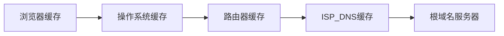

[TOC]

# URL回车后会发生什么

## 1. URL解析

**地址解析**

​	首先判断输入的是合法的URL或者是一个待搜索的关键字，并且根据你输入的内容进行自动完成、字符编码操作。


​	然后生成HTTP报文


**HSTS**

​	由于安全隐患，会使用HSTS强制客户端使用HTTPS访问页面。

**其他操作**

​	浏览器会进行一些安全检查、访问限制等操作

**检查缓存**


## 2. DNS查询



**ISP DNS**

​	就是在客户端设置的首选的DNS服务器，它们在大多数情况下都有缓存。

**根域名服务器查询**


## 3. 协议栈


**ICMP**

​	用于告知网络包传送过程中产生的错误以及各种错误信息

**ARP**

​	用于根据IP地址查询相应的以太网MAC地址

## 4. TCP连接

先看看TCP报文头部格式


**源端口号**和**目的端口号**是确定来源和目标的端口，一般客户的端口都是随机的，服务器的话，HTTP是80，HTTPS是443

**序号**用于解决包乱序的问题

**确认号**，目的是确认对方是否有收到信息，没有收到就要重发。用于解决不丢包的问题。

**状态位**，SYN发起一个请求，ACK是回复响应，RET是重新连接，FIN是结束连接。TCP是面向连接的，双方要维护连接的状态。

**校验和**用于校验数据是否有误。

### TCP三次连接


其实第二次握手的时候是两步合在一起了，如果硬要分开的话，应该是服务端先ACK x + 1，然后再SYN y

### 在linux中，查看TCP连接状态

```shell
netstat -napt
```


### TCP 分割数据

**MTU**：一个网络包的最大长度，一般为1500字节

**MSS**：出去IP和TCP头部之后，一个网络包所能容纳的TCP数据的大小


### TCP报文生成

## 5. 远程定位 IP

如果存在多个网卡，就需要根据路由表规则来判断具体选择哪一个网卡作为源地址IP。

linux中，使用该命令查看当前系统的路由表

```linux
route -n
```

**网络报文如下**：


​	接下来是MAC、网卡、交换机。注意，交换机是没有MAC的地址的，它会把接收的包都缓存起来。而我们的计算机是有MAC地址的，计算机在接收的数据包的时候会判断目标地址是否和本机MAC相同，不同就丢弃。如果目标MAC是广播地址，也就是MAC中的FF:FF:FF:FF:FF:FF，IP地址中的255.255.255.255，那么交换机会将包发送到除了源端口之外的所有端口。

​	然后通过路由器将数据包转发出去。

​	路由器与交换机的区别：

> 路由器是基于IP设计的，俗称三层网络设备，路由器的各个端口都有MAC地址的IP地址
>
> 交换机是基于以太网设计的，俗称二次网络设备，交换机的端口不具有MAC地址

​	如果路由器在检查这个MAC头部的接收方MAC地址，如果是就放到缓存，否则丢弃。之后，查询路由表确定输出端口，去除原来的MAC包，然后再组装新的MAC包。

​	在网络包的传输过程中，源IP和目标IP是不会变的，变的只是MAC地址，因为需要MAC在以太网进行两个设备的包传输。

## 6. 服务端拆包


​	服务端会先扒开数据包的MAC头部，查看MAC地址是否和自己的MAC地址相同。	

​	然后拆开IP的头部，查询IP地址是否符合，之后根据IP头的协议项查询是否是TCP还是UDP。

​	如果是TCP，就继续拆开TCP头部，判断里面的序列号是否是服务器想要的，如果是就放到缓存中并且返回一个ACK，否则丢弃。TCP里面还有端口号，HTTP服务器正在监听这个端口。

​	之后，服务器就知道是HTTP进程想要这个包，于是就把该包发给HTTP进程。

​	服务器的HTTP发现这个请求是要请求一个页面，于是就把网页封装在HTTP的响应报文里。

​	HTTP响应报文也要加上TCP、IP、MAC头部，和之前客户端发送的一样，经过交换机和路由器将数据转发到客户端，客户端再进行拆包，渲染页面。

​	最后，客户端向服务器发起了TCP四次挥手，over。